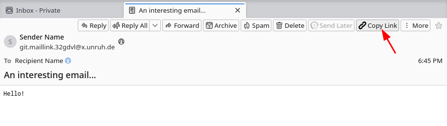
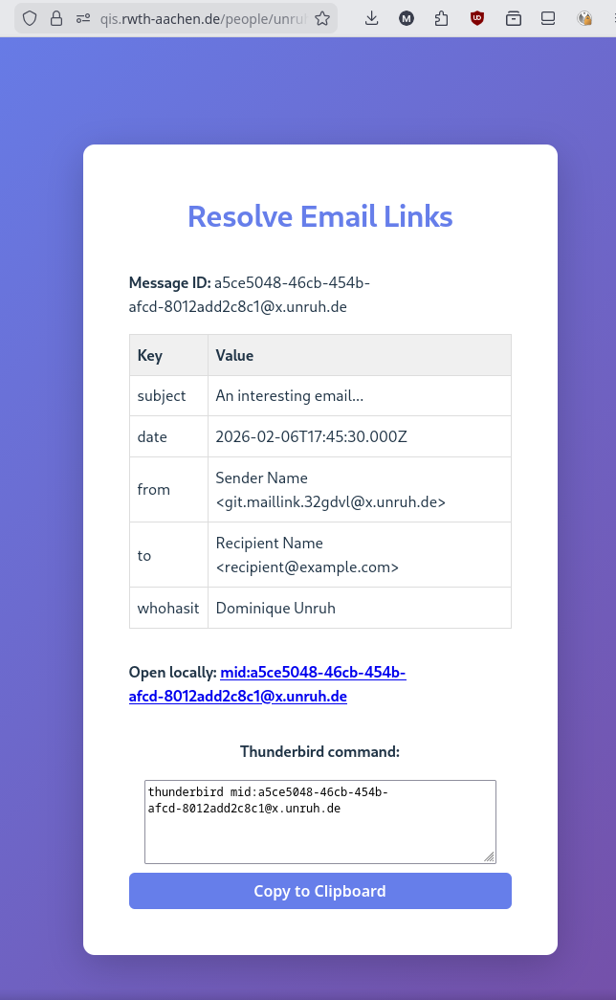

# Overview

Thunderbird extension to produce links to individual emails.

These links can be used, e.g., in your to-do lists, shared planning documents,
calendar entries, etc.

The links uniquely identify the message via it's message-id, but contain additional
information about the email to find it when message-id search is not available.
(E.g., subject, date, sender, ...)

The links are `https://` links, so they work on any system.
(Special links to email such as `mid:...` are standardized but they aren't widely supported.
E.g., it is not possible to make a hyperlink in Google Docs where the target is an `mid:` URI.)

The link directs to a landing page that gives the recipient of the link
information how to find it. (If supported, it will also directly be opened in your mail client.)

# Workflow

1. Open the email in Thunderbird.
2. Click on the *🔗 Copy Link* button. 
3. (The first time, you will be redirected to the add-on options. Fill and save them.)
4. Paste the link in some notes where you want to refer to the email.
   Example: *Don't forget to answer the [interesting email](https://qis.rwth-aachen.de/people/unruh/tools/mail-link/#a5ce5048-46cb-454b-afcd-8012add2c8c1%40x.unruh.de&subject=An%20interesting%20email...&date=2026-02-06T17%3A45%3A30.000Z&from=Sender%20Name%20%3Cgit.maillink.32gdvl%40x.unruh.de%3E&to=Recipient%20Name%20%3Crecipient%40example.com%3E&whohasit=Dominique%20Unruh)!*
5. Later, open the link and find the email again. (Or someone else can do it, too.)
   You will see this landing page (and possibly the email opens directly in your mail client.)
   

# Privacy

* The add-on collects no information besides what it includes in the generated link
* The generated link contains some information about the email but not the email body.
  You can configure in the options what should be included.
* Who has the link only gets the message-id and the optionally included data.
  If the person does not have the email yet, they will not be able to get it using the link.
* Clicking on the link does not transfer information about the email (even the data included in the link)
  to the server hosting the landing page. (Unless the server serves a malicious webpage that transfers information back.)
* You can host your own landing page if you prefer. (Source is available [here](https://github.com/dominique-unruh/mail-link/tree/main/webapp).)

# Lack of warranty

The add-on is provided as is and without warranty of any kind.
The author is not responsible for any harm or damages resulting from the use of this add-on.

# License

